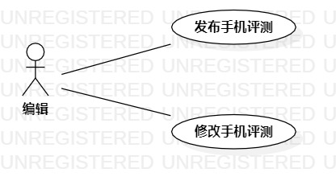

# 实验二：用例建模

# 一：实验目标

1. 完善选题
2. 完成用例建模

# 二：实验内容

1. 建立选题
2. 用例建模
3. 编写用例规约

# 三：实验步骤

1. 确定选题为：手机信息资讯平台
2. 确定用例
   - 发布手机评测
   - 修改手机评测
3. 确定参与者
   - 编辑
4. 使用StarUML画用例图
5. 编写用例规约

# 实验结果

图1：手机信息资讯平台用例图

## 表1：发布手机评测用例规约  

用例编号  | UC01 | 备注  
-|:-|-  
用例名称  | 发布手机评测  |   
前置条件  | 编辑已经登陆     | *可选*   
后置条件  | 系统提示发布成功     | *可选*   
基本流程  | 1. 编辑点击发布按钮  |*用例执行成功的步骤*    
~| 2. 系统显示发布手机评测页面 |   
~| 3. 编辑填写标题、正文、链接，点击确定按钮  |   
~| 4. 系统检查各项信息不为空，保存手机评测信息  |   
~| 5. 系统提示发布成功  |  
扩展流程  | 4.1 系统检查到无标题，提示“请输入标题”   |*用例执行失败*    
~| 4.2 系统检查到正文为空，提示“请输入正文内容”   |  

## 表2：修改手机评测用例规约  

用例编号  | UC02 | 备注  
-|:-|-  
用例名称  | 修改手机评测  |   
前置条件  | 编辑已经登陆     | *可选*   
后置条件  | 系统提示“修改成功”     | *可选*   
基本流程  | 1. 编辑点击自己已经发布的手机评测的修改按钮  |*用例执行成功的步骤*    
~| 2. 系统显示修改手机评测页面 |   
~| 3. 编辑修改评测信息，点击确定按钮  |   
~| 4. 系统检查各项信息不为空，保存手机评测信息  |   
~| 5. 系统提示“修改成功”  |  
扩展流程  | 4.1 系统检查到无标题，提示“请输入标题”   |*用例执行失败*    
~| 4.2 系统检查到正文为空，提示“请输入正文内容”   |  
