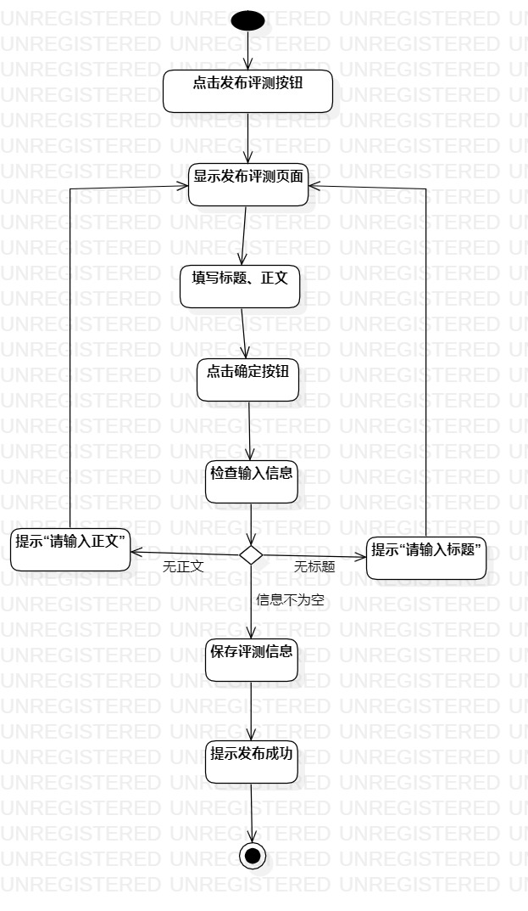
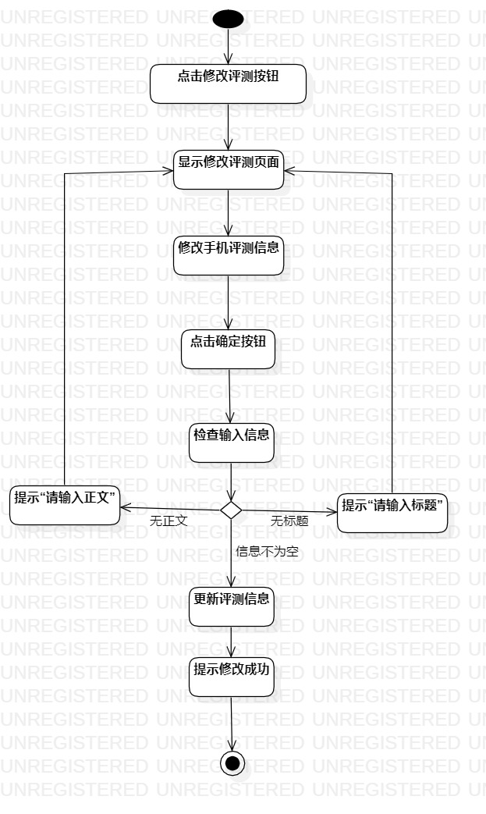

# 实验三：过程建模

## 一、实验目标

1. 掌握过程建模的方法
2. 掌握活动图的画法

## 二、实验内容

1. 根据用例规约画活动图

## 三、实验步骤

1. 创建发布评测、修改评测的活动图
2. 创建开始节点、结束节点.
3. 根据用例规约的基本流程何扩展流程来添加操作
4. 通过控制流连接
5. 通过对齐、自动调整大小等操作使活动图简洁易读

## 四、实验结果

1. 发布手机评测活动图

2. 修改手机评测信息活动图
